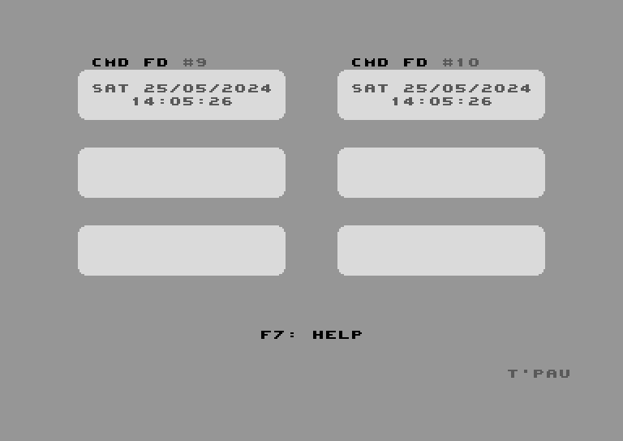

# Anytime

This program automatically detects supported real time clocks connected to your Commodore 64 and continuously displays them.

It is currently in the early stages of development. Setting clocks is not yet supported.

## Supported Devices

- BackBit Cartridge
- CMD FD-2000 with Real Time Clock module
- CMD FD-4000
- CMD HD
- CMD RAMLink
- CMD SmartMouse and SmartTrack
- IDE64
- MEGA65
- SD2IEC with Real Time Clock
- User Port DS3231 Real Time Clock Module

## Using Anytime

For detailed usage instructions, see the [documentation](Documentation/Anytime.md).

## Building Joyride

See [BUILDING.md](BUILDING.md)
